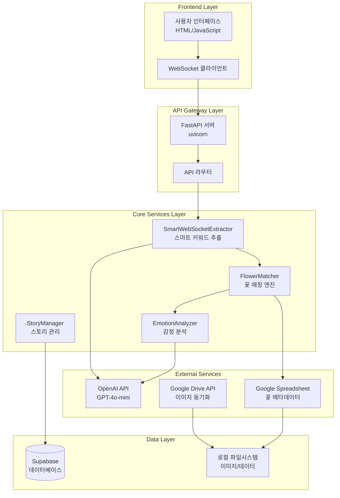
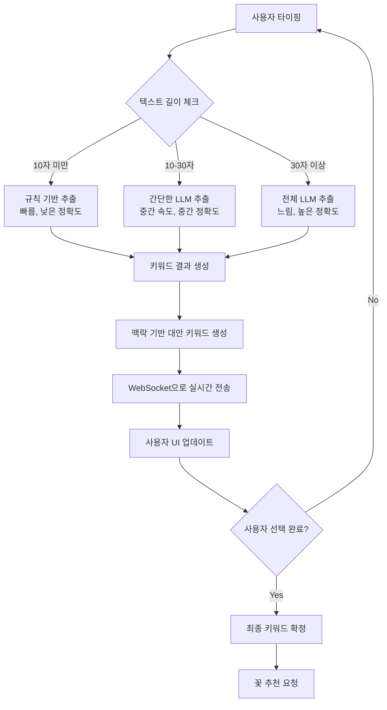
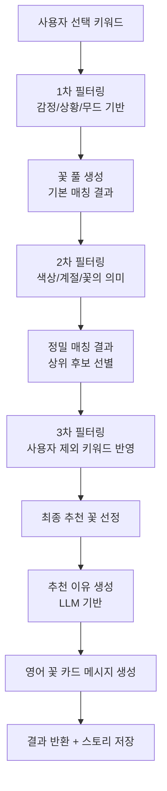
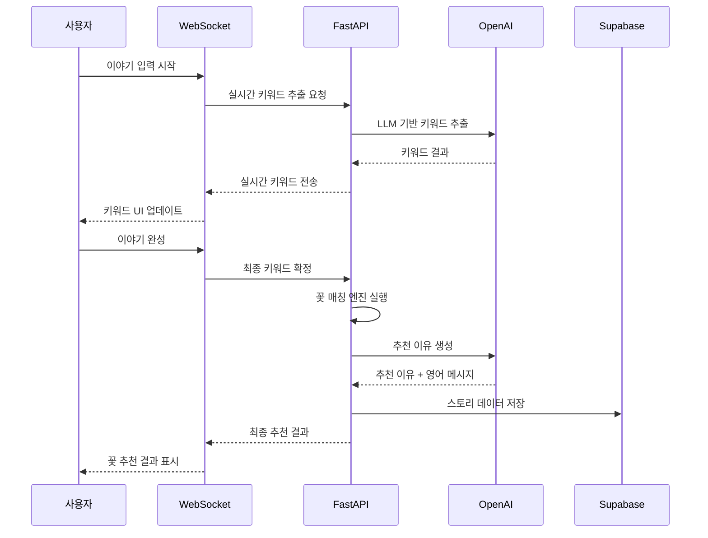
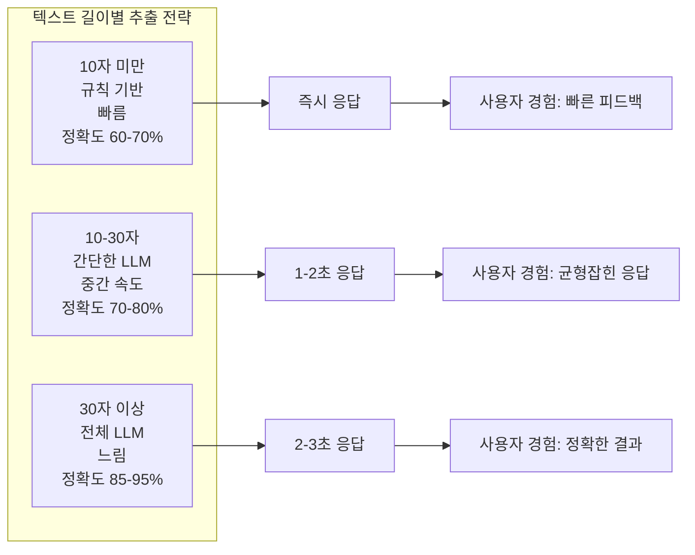
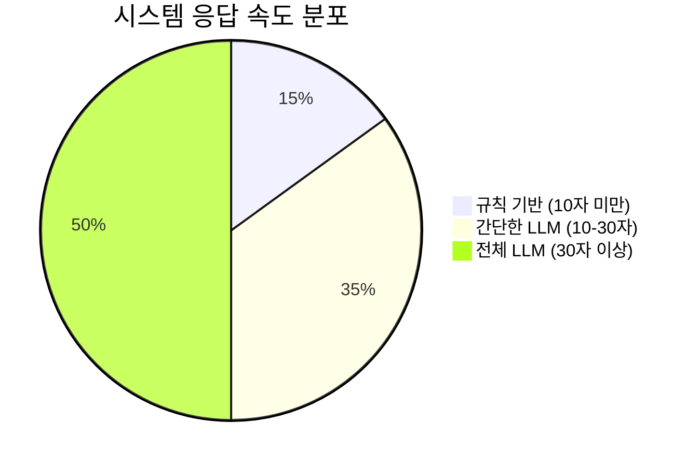
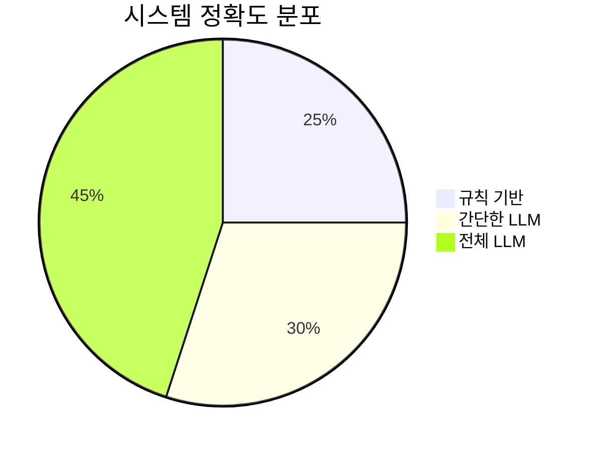
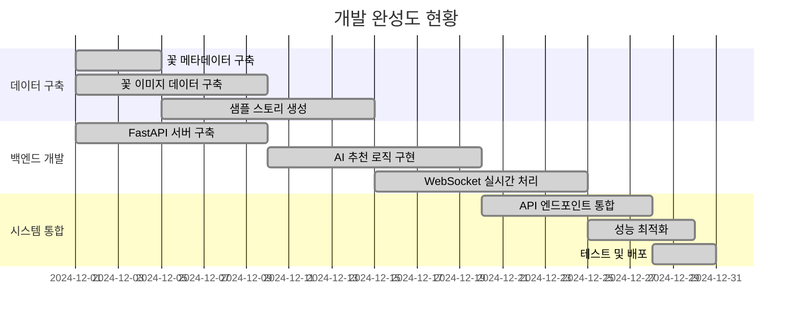

# 🏗️ 시스템 아키텍처 및 플로우차트

## **1. 전체 시스템 아키텍처**



## **2. 실시간 키워드 추출 플로우**



## **3. 꽃 매칭 엔진 플로우**



## **4. 데이터 흐름 파이프라인**



## **5. 스마트 추출 전략 매트릭스**



## **6. 맥락 기반 키워드 생성 예시**

```mermaid
graph TD
    A[사용자 입력: "친구 생일 축하하고 싶어요"] --> B[감정 추출: "기쁨"]
    
    B --> C[상황 참조: "생일"]
    C --> D[감정 대안 생성: "사랑", "설렘"]
    
    A --> E[색상 추출: "핑크"]
    E --> F[감정 참조: "기쁨"]
    F --> G[색상 대안 생성: "라일락", "화이트"]
    
    A --> H[무드 추출: "따뜻한"]
    H --> I[감정 참조: "기쁨"]
    I --> J[무드 대안 생성: "경쾌한", "밝은"]
    
    D --> K[최종 감정: 기쁨 + 사랑, 설렘]
    G --> L[최종 색상: 핑크 + 라일락, 화이트]
    J --> M[최종 무드: 따뜻한 + 경쾌한, 밝은]
```

## **7. 시스템 성능 지표**





## **8. 개발 완성도 현황**



---

**이 다이어그램들은 Floiy-Reco 시스템의 전체적인 구조와 데이터 흐름을 시각적으로 보여줍니다.** 🎯✨
