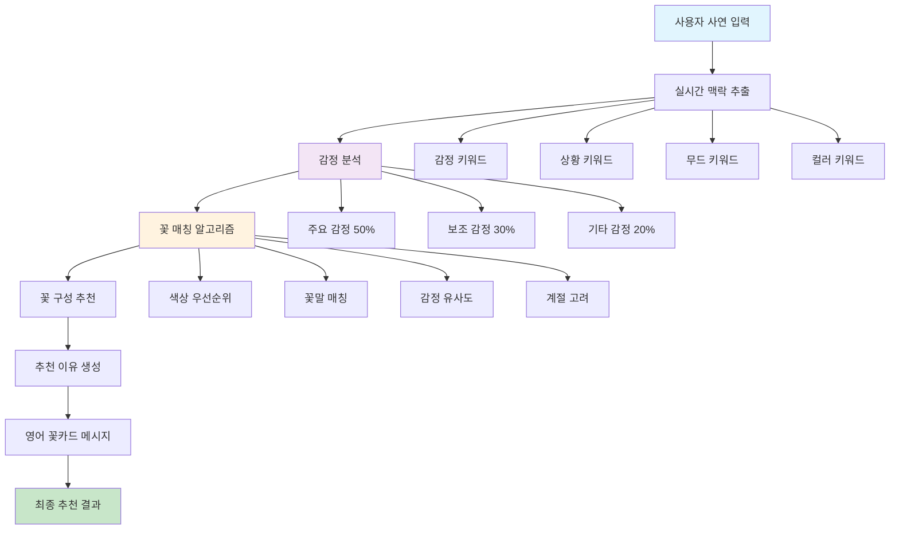

# 꽃 추천 AI 시스템 아키텍처

```mermaid
graph TB
    A[사용자 사연 입력] --> B[실시간 맥락 추출]
    B --> C[감정 분석]
    C --> D[꽃 매칭 알고리즘]
    D --> E[꽃 구성 추천]
    E --> F[추천 이유 생성]
    F --> G[영어 꽃카드 메시지]
    G --> H[최종 추천 결과]
    
    B --> B1[감정 키워드]
    B --> B2[상황 키워드]
    B --> B3[무드 키워드]
    B --> B4[컬러 키워드]
    
    C --> C1[주요 감정 50%]
    C --> C2[보조 감정 30%]
    C --> C3[기타 감정 20%]
    
    D --> D1[색상 우선순위]
    D --> D2[꽃말 매칭]
    D --> D3[감정 유사도]
    D --> D4[계절 고려]
    
    style A fill:#e1f5fe
    style H fill:#c8e6c9
    style D fill:#fff3e0
    style C fill:#f3e5f5
```

## 핵심 기술 스택
- **FastAPI**: RESTful API 서버
- **OpenAI GPT-4**: 감정 분석 및 키워드 추출
- **LangChain**: 체인 기반 처리 파이프라인
- **Supabase**: 이미지 저장소 및 데이터베이스
- **Python**: 백엔드 로직 구현

