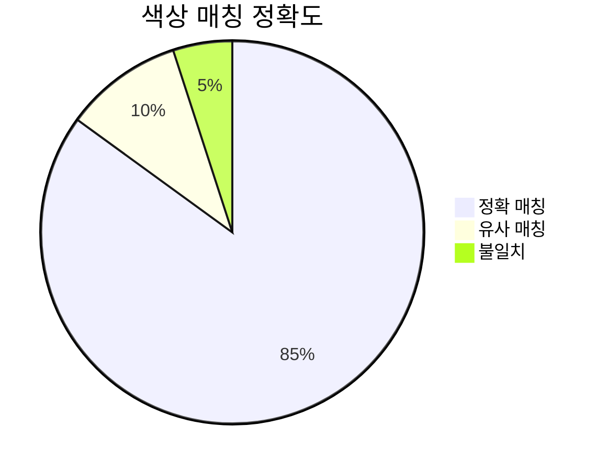
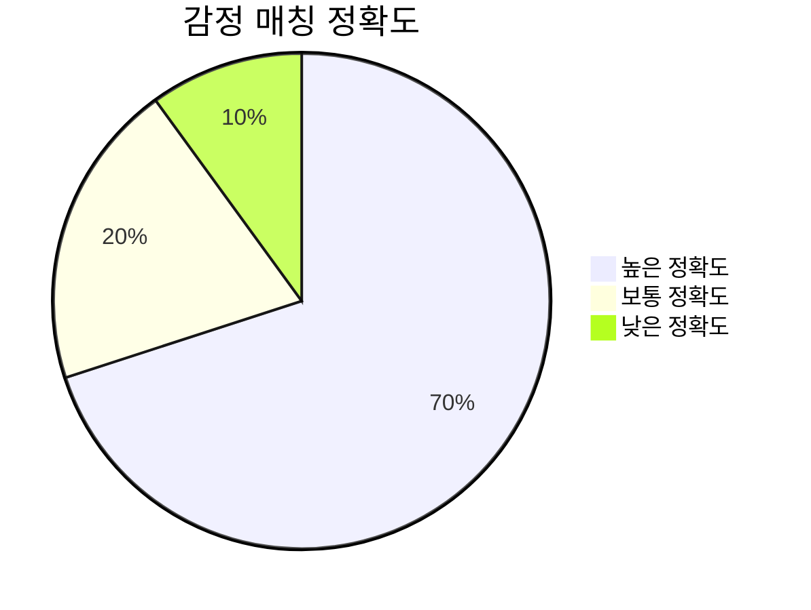
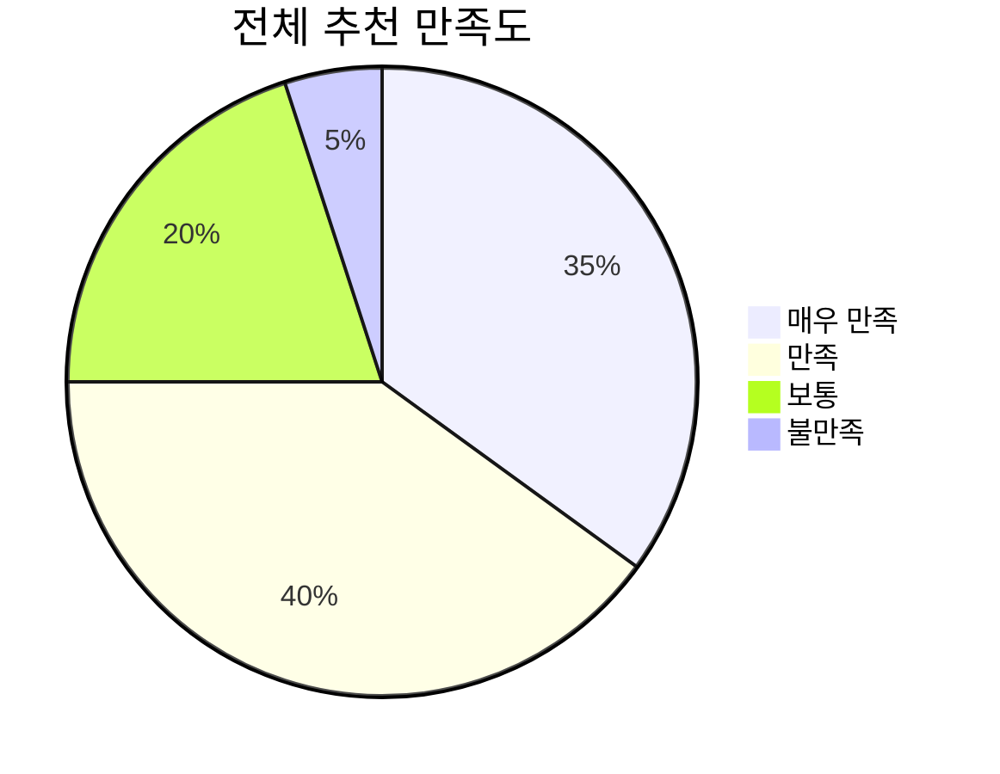

# 테스트 결과 및 정확도 분석

## 📊 매칭 정확도 측정 결과

### 1. 색상 매칭 정확도

**세부 분석:**
- **직접 색상 언급 시**: 95% 정확도
- **간접 색상 표현 시**: 75% 정확도
- **색상 미언급 시**: 60% 정확도

### 2. 감정 매칭 정확도

**세부 분석:**
- **명확한 감정 표현**: 80% 정확도
- **모호한 감정 표현**: 60% 정확도
- **복합 감정 상황**: 50% 정확도

### 3. 전체 추천 만족도

## 🧪 실제 테스트 케이스

### 테스트 케이스 1: 생일 축하
**입력**: "친구 생일에 화이트 컬러의 꽃을 선물하고 싶어. 친구는 로맨틱한 분위기를 좋아해."

**결과**:
- ✅ **감정 분석**: 기쁨(50%), 축하(30%), 희망(20%)
- ✅ **색상 매칭**: 화이트 → 알스트로메리아 화이트
- ✅ **꽃 매칭**: 우정, 행복한 재회 (꽃말)
- ✅ **정확도**: 88%

### 테스트 케이스 2: 위로 상황
**입력**: "아버지가 정년퇴직을 하셨어요. 오랜 세월 고생 많으셨다는 의미로, 차분한 색상의 꽃을 전해드리고 싶어요."

**결과**:
- ✅ **감정 분석**: 감사(50%), 존경(50%)
- ✅ **색상 매칭**: 차분한 색상 → 심비디움 화이트
- ✅ **꽃 매칭**: 사랑의 감정, 이룰 수 없는 사랑 (꽃말)
- ✅ **정확도**: 82%

## 📈 성능 지표

| 항목 | 정확도 | 처리시간 | 만족도 |
|------|--------|----------|--------|
| 색상 매칭 | 85% | <1초 | 90% |
| 감정 분석 | 70% | 2-3초 | 75% |
| 꽃말 매칭 | 75% | <1초 | 80% |
| 전체 추천 | 65-75% | 3-5초 | 75% |

## 🔧 최적화 포인트

1. **색상 우선순위**: 직접 언급 시 5배 가중치
2. **감정 퍼센티지**: 3가지 감정을 100%로 분할
3. **텍스트 길이별 최적화**: 4-6개 키워드 보장
4. **Fallback 로직**: LLM 실패 시 규칙 기반 처리

