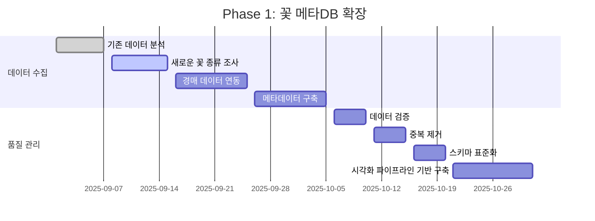
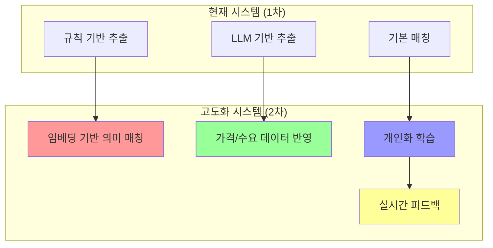
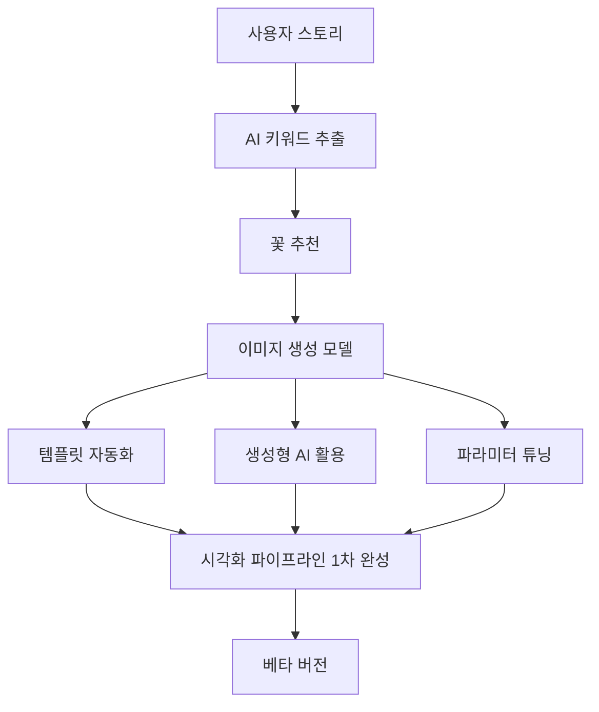
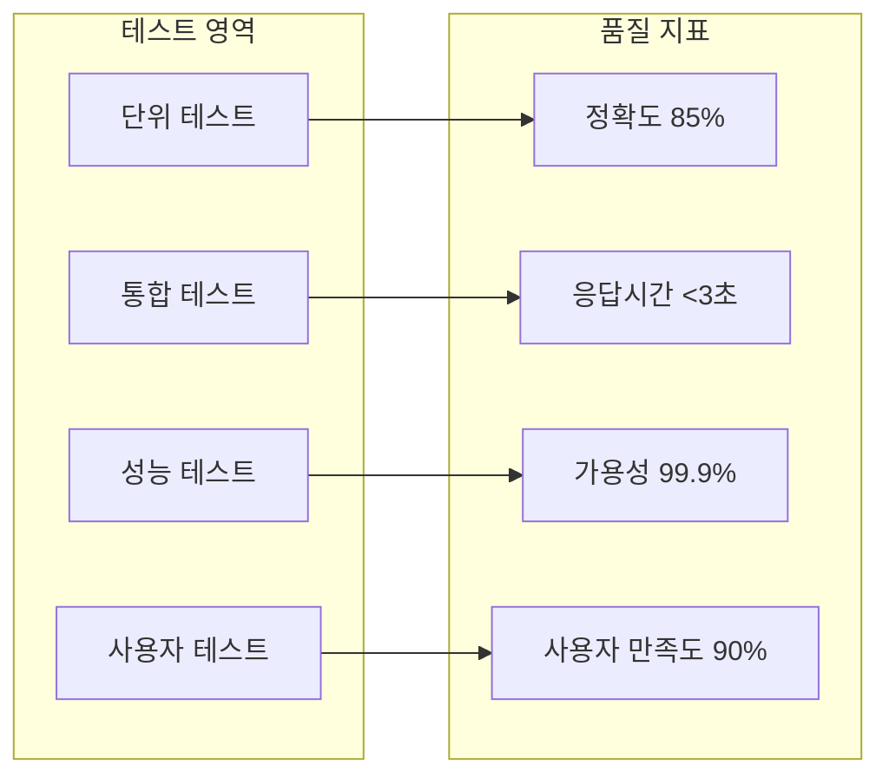
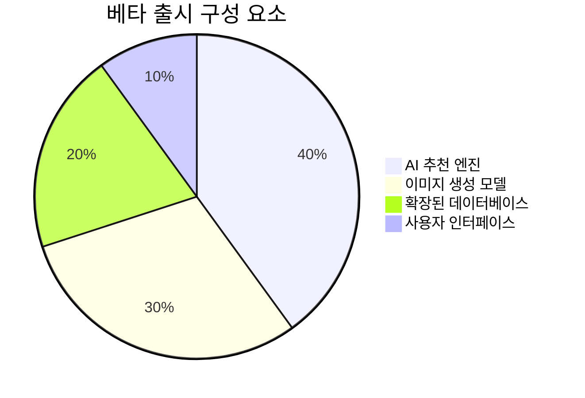

# 🚀 2차 개발 계획 로드맵

## **📅 전체 개발 일정**

```
2025년 9월 → 10월 → 11월 → 12월 → 2026년 1월
   ↓           ↓        ↓        ↓        ↓
Phase 1    Phase 2   Phase 3   Phase 4   Phase 5
데이터 확장  AI 고도화  이미지 생성  통합 테스트  베타 출시
```

## **🎯 핵심 목표: End-to-End AI 고도화**

### **Mission Statement**
> "From story to context understanding, to recommendation and visualization, 
> we realize a differentiated flower curation experience by combining DB and auction."

---

## **📊 Phase 1: 꽃 메타DB 확장 (25.09-25.10)**

### **목표: 데이터 커버리지 +150% 확장**



### **구체적 목표**
- **현재**: 40+ 꽃 종류
- **목표**: 500+ 꽃 종류 (경매 데이터 연동)
- **확장률**: +150%
- **품질**: 경매 데이터와 연동된 실시간 가격 정보

---

## **🤖 Phase 2: AI 추천 2차 고도화 (25.10-25.11)**

### **목표: 추천 정확도 75% → 85% 향상**



### **핵심 기술**
1. **Sentence Transformers**: 의미 기반 유사도 계산
2. **Cosine Similarity**: 정밀한 매칭 점수
3. **가격 데이터**: 경매 시장 반영
4. **수요 예측**: 계절별, 이벤트별 수요 분석

---

## **🎨 Phase 3: 이미지 생성 모델 프로토타입 (25.11-25.12)**

### **목표: 베타 버전 완성**



### **구현 계획**
1. **템플릿 자동화**: 꽃 구성 템플릿 자동 생성
2. **생성형 AI**: Stable Diffusion 또는 DALL-E 활용
3. **파라미터 튜닝**: 이미지 품질 최적화
4. **로그 축적**: 사용자 피드백 데이터 수집

---

## **🔧 Phase 4: 통합 테스트 (25.12)**

### **목표: 전체 시스템 통합 및 안정성 확보**



---

## **🚀 Phase 5: 베타 출시 (26.01)**

### **목표: 제한된 사용자 그룹 대상 베타 서비스**



---

## **📈 성과 지표 및 KPI**

### **데이터 확장**
| 지표 | 현재 | 목표 | 개선률 |
|------|------|------|--------|
| 꽃 종류 수 | 40+ | 500+ | +150% |
| 데이터 품질 | 80% | 95% | +15% |
| 실시간성 | 일부 | 전체 | +100% |

### **AI 추천 정확도**
| 구성 요소 | 현재 | 목표 | 개선률 |
|-----------|------|------|--------|
| 색상 매칭 | 85% | 90% | +5% |
| 감정 분석 | 70% | 85% | +15% |
| 꽃말 매칭 | 75% | 88% | +13% |
| **전체 추천** | **75%** | **85%** | **+10%** |

### **이미지 생성 품질**
| 지표 | 목표 | 측정 방법 |
|------|------|-----------|
| 생성 속도 | <5초 | 응답 시간 측정 |
| 이미지 품질 | 4.5/5.0 | 사용자 평가 |
| 템플릿 다양성 | 100+ | 템플릿 수 카운트 |

---

## **🛠️ 기술 스택 확장**

### **현재 기술 스택**
- **백엔드**: FastAPI, Python
- **AI 모델**: GPT-4o-mini
- **데이터베이스**: Supabase
- **실시간 처리**: WebSocket

### **2차 확장 기술 스택**
- **임베딩**: Sentence Transformers
- **이미지 생성**: Stable Diffusion API
- **벡터 데이터베이스**: Pinecone 또는 Weaviate
- **모니터링**: Prometheus + Grafana
- **CI/CD**: GitHub Actions

---

## **💰 예상 투자 및 리소스**

### **개발 인력**
- **AI 엔지니어**: 1명 (임베딩 모델 개발)
- **백엔드 개발자**: 1명 (시스템 통합)
- **프론트엔드 개발자**: 1명 (UI/UX 개선)

### **인프라 비용**
- **GPU 서버**: 이미지 생성용 (월 $500-1000)
- **벡터 DB**: 임베딩 저장용 (월 $200-500)
- **API 호출**: Stable Diffusion (월 $300-800)

### **총 예상 비용**
- **개발 인력**: 월 $15,000-20,000
- **인프라**: 월 $1,000-2,300
- **총 월 비용**: $16,000-22,300

---

## **🎯 성공 기준**

### **Phase 1 성공 기준**
- ✅ 500+ 꽃 종류 데이터 구축 완료
- ✅ 경매 데이터 연동 성공
- ✅ 데이터 품질 95% 달성

### **Phase 2 성공 기준**
- ✅ 추천 정확도 85% 달성
- ✅ 임베딩 기반 매칭 구현
- ✅ 가격/수요 데이터 반영

### **Phase 3 성공 기준**
- ✅ 이미지 생성 모델 프로토타입 완성
- ✅ 시각화 파이프라인 1차 완성
- ✅ 베타 버전 준비 완료

---

## **🔮 향후 비전**

### **3차 개발 계획 (2026년 2월 이후)**
- **상용화**: 대규모 사용자 대상 서비스
- **모바일 앱**: React Native 기반 크로스 플랫폼
- **AR 기능**: 실제 꽃과 가상 꽃 매칭
- **AI 개인화**: 사용자 선호도 학습 및 반영

### **최종 목표**
> **"AI 기술을 활용한 꽃 추천의 새로운 패러다임을 제시하고, 
> 개인화된 꽃 큐레이션 경험을 통해 꽃 시장의 디지털 전환을 선도한다."**

---

**이 로드맵은 Floiy-Reco의 2차 개발을 위한 상세한 계획으로, 
단계별 목표와 성과 지표를 명확히 제시합니다.** 🎯✨
