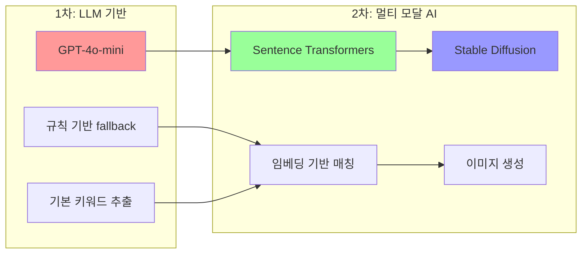
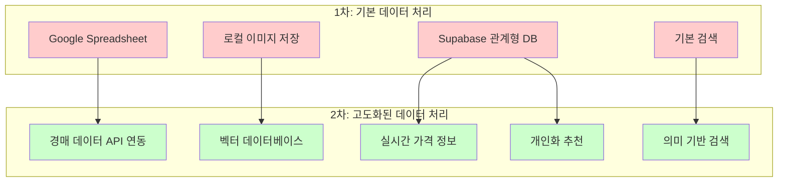
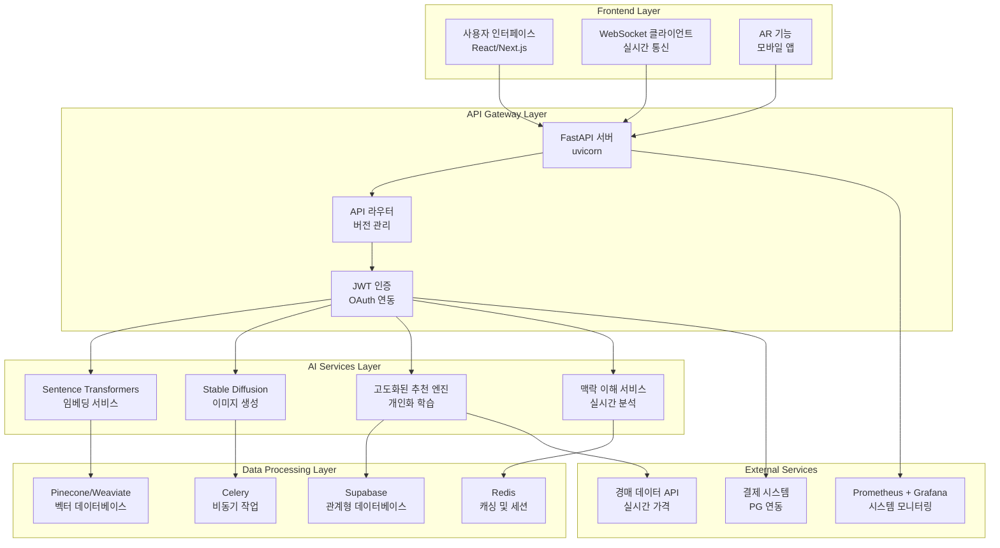
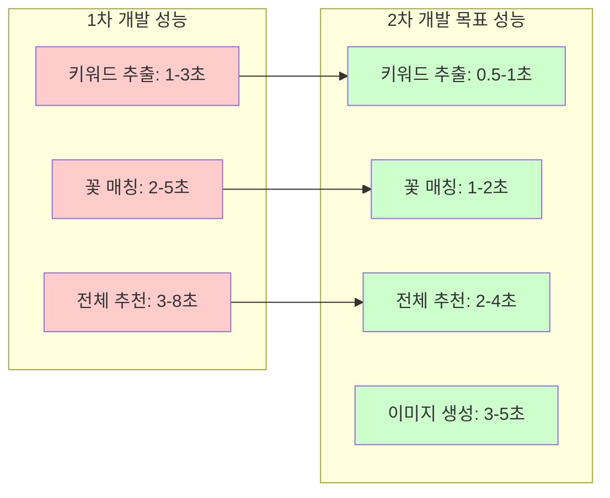
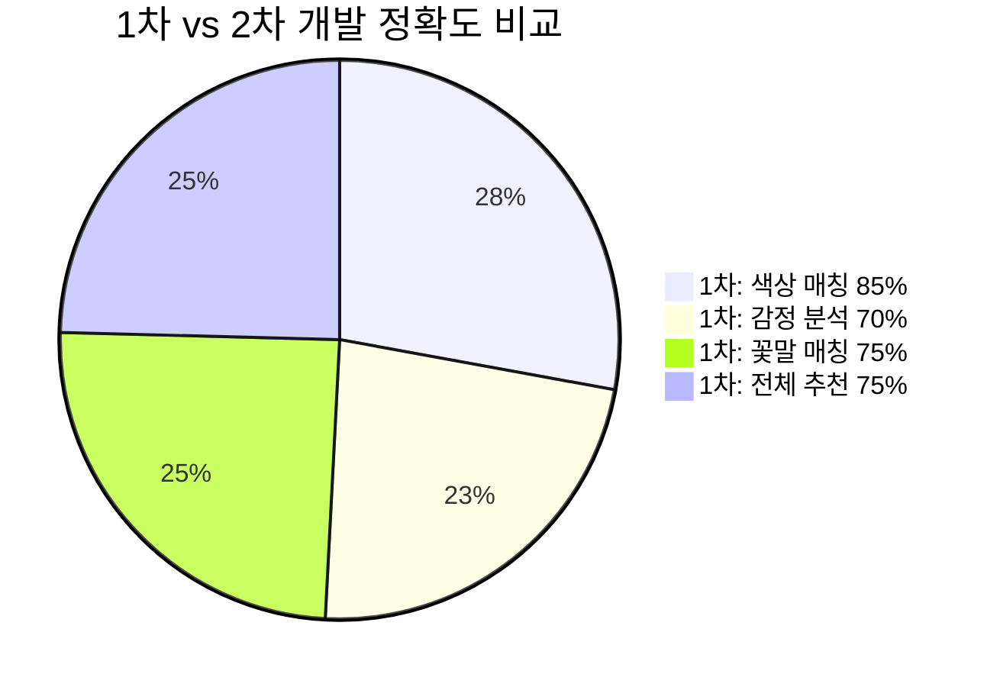
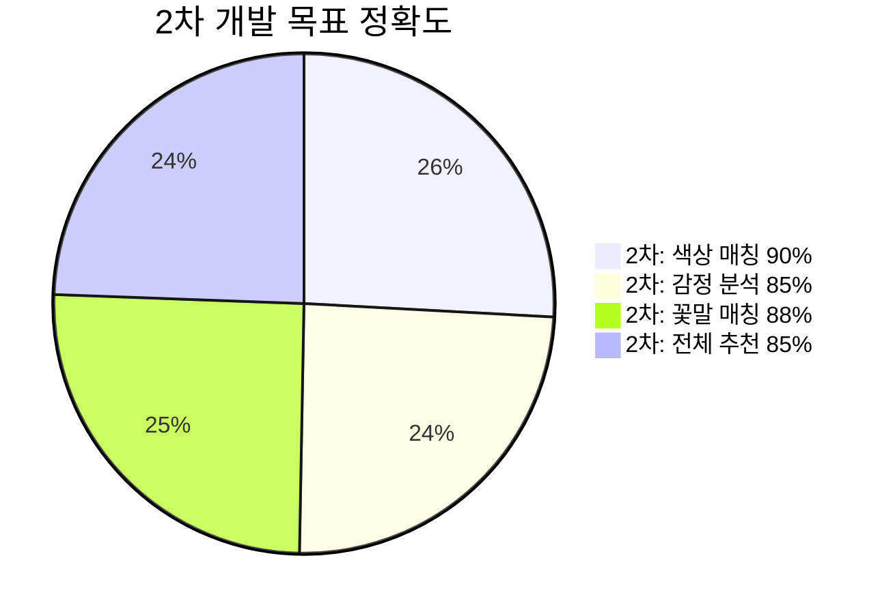
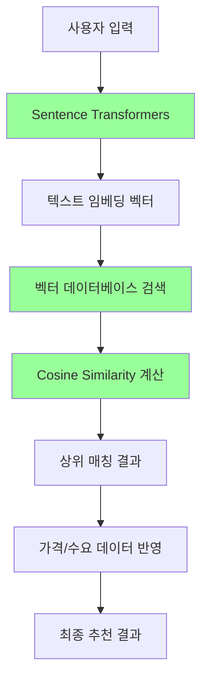
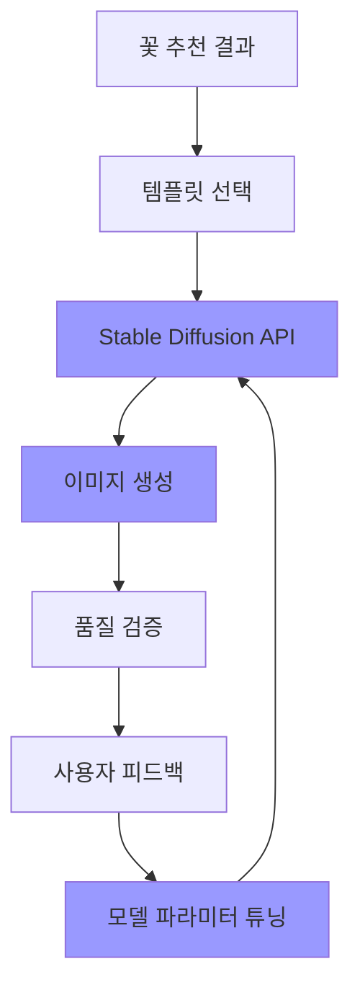
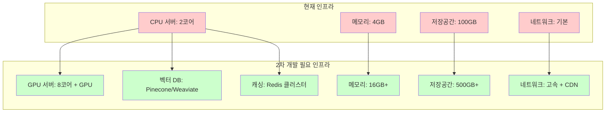
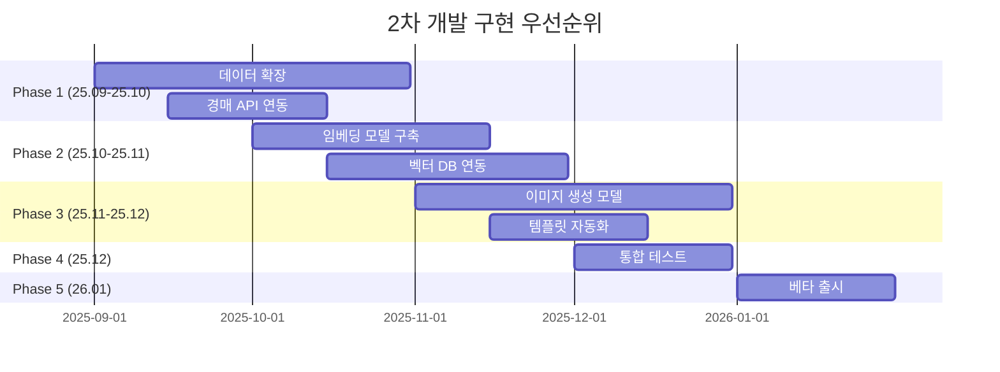

# 🏗️ 2차 개발 기술 아키텍처 진화

## **🔄 시스템 진화 과정**

### **1차 개발 (현재) → 2차 개발 (목표)**

```mermaid
graph TB
    subgraph "1차 개발 (현재)"
        A1[규칙 기반 키워드 추출]
        A2[GPT-4o-mini 기반 추출]
        A3[기본 꽃 매칭]
        A4[HTTP API + WebSocket]
        A5[Supabase 데이터베이스]
    end
    
    subgraph "2차 개발 (목표)"
        B1[임베딩 기반 의미 매칭]
        B2[멀티 모달 AI (텍스트 + 이미지)]
        B3[고도화된 꽃 매칭 + 가격 반영]
        B4[실시간 스트리밍 + 개인화]
        B5[벡터 DB + 관계형 DB 하이브리드]
    end
    
    A1 --> B1
    A2 --> B2
    A3 --> B3
    A4 --> B4
    A5 --> B5
    
    style A1 fill:#ffcccc
    style A2 fill:#ffcccc
    style A3 fill:#ffcccc
    style A4 fill:#ffcccc
    style A5 fill:#ffcccc
    
    style B1 fill:#ccffcc
    style B2 fill:#ccffcc
    style B3 fill:#ccffcc
    style B4 fill:#ccffcc
    style B5 fill:#ccffcc
```

---

## **🎯 핵심 기술 진화**

### **AI 모델 진화**



### **데이터 처리 진화**



---

## **🏗️ 2차 개발 시스템 아키텍처**

### **전체 시스템 구조**



---

## **🚀 성능 향상 지표**

### **처리 속도 개선**



### **정확도 향상**





---

## **🔧 기술 구현 세부사항**

### **임베딩 기반 의미 매칭**



### **이미지 생성 파이프라인**



---

## **📊 리소스 요구사항**

### **인프라 요구사항**



---

## **🎯 구현 우선순위**

### **Phase별 구현 순서**



---

**이 문서는 Floiy-Reco의 2차 개발에서 기술적 진화 과정과 새로운 아키텍처를 상세히 보여줍니다.** 🚀✨
