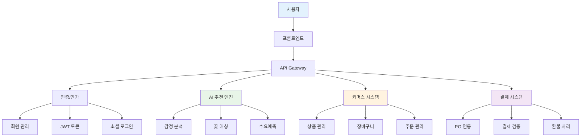

# 꽃 추천 AI 시스템: 전체 개발 로드맵 (커머스 포함)

## 🏗️ **전체 시스템 아키텍처**



---

## 📋 **1차 개발 (완료)**

### **AI 추천 엔진 기반**
- ✅ **감정 분석**: GPT-4 기반 3가지 감정 퍼센티지 분할
- ✅ **꽃 매칭**: 색상 우선순위 + 꽃말 매칭 알고리즘
- ✅ **키워드 추출**: 4차원 실시간 맥락 추출
- ✅ **API 시스템**: 4개 핵심 엔드포인트 구축
- ✅ **데이터베이스**: 187개 꽃 정보 + 이미지

**정확도**: 65-75% (목표 60-70% 초과)

---

## 🚀 **2차 개발 (AI 고도화)**

### **Phase 1: 임베딩 기반 고도화 (2-3개월)**
```python
# 핵심 기술
- Sentence Transformer 모델 도입
- 꽃 데이터베이스 임베딩화
- 하이브리드 매칭 시스템
- 정확도 목표: 75% → 85%
```

### **Phase 2: 수요예측 시스템 (3-4개월)**
```python
# 핵심 기술
- 경매 데이터 수집 및 분석
- 시계열 예측 모델 (Prophet, LSTM)
- 계절별 트렌드 분석
- 가격 예측 및 최적화
```

### **Phase 3: 꽃다발 구성 시스템 (2-3개월)**
```python
# 핵심 기술
- 예산 기반 최적화 알고리즘
- 색상 조화 분석
- 동적 프로그래밍 기반 구성
- 실시간 가격 반영
```

**총 기간**: 7-10개월

---

## 🛒 **3차 개발 (커머스 시스템)**

### **Phase 1: 회원 관리 시스템 (2-3개월)**

#### **인증/인가 시스템**
```python
# 기술 스택
- JWT 토큰 기반 인증
- 소셜 로그인 (카카오, 네이버, 구글)
- 이메일 인증
- 비밀번호 재설정

# 데이터베이스 설계
users = {
    "id": "UUID",
    "email": "string",
    "password_hash": "string", 
    "name": "string",
    "phone": "string",
    "social_provider": "kakao|naver|google",
    "social_id": "string",
    "created_at": "datetime",
    "updated_at": "datetime"
}
```

#### **회원 프로필 관리**
```python
# 기능
- 개인정보 수정
- 배송지 관리 (기본/추가)
- 주문 내역 조회
- 찜한 꽃 관리
- 추천 히스토리
```

### **Phase 2: 상품 관리 시스템 (2-3개월)**

#### **상품 데이터베이스**
```python
# 상품 테이블
products = {
    "id": "UUID",
    "flower_id": "string",  # AI 추천 시스템과 연동
    "name": "string",
    "description": "text",
    "price": "integer",
    "stock": "integer",
    "category": "single|bouquet|arrangement",
    "season": "spring|summer|fall|winter|all",
    "image_urls": "array",
    "is_active": "boolean"
}

# 꽃다발 구성 테이블
bouquet_compositions = {
    "id": "UUID",
    "bouquet_id": "UUID",
    "flower_id": "UUID",
    "quantity": "integer",
    "position": "main|sub|accent|green"
}
```

#### **상품 관리 기능**
```python
# 기능
- 상품 등록/수정/삭제
- 재고 관리
- 가격 관리
- 이미지 관리
- 카테고리 관리
- 검색 및 필터링
```

### **Phase 3: 장바구니 및 주문 시스템 (3-4개월)**

#### **장바구니 시스템**
```python
# 장바구니 테이블
cart_items = {
    "id": "UUID",
    "user_id": "UUID",
    "product_id": "UUID",
    "quantity": "integer",
    "added_at": "datetime"
}

# 기능
- 장바구니 추가/수정/삭제
- 수량 변경
- 장바구니 비우기
- 찜하기 기능
```

#### **주문 시스템**
```python
# 주문 테이블
orders = {
    "id": "UUID",
    "user_id": "UUID",
    "order_number": "string",
    "status": "pending|paid|preparing|shipping|delivered|cancelled",
    "total_amount": "integer",
    "shipping_address": "object",
    "recipient_name": "string",
    "recipient_phone": "string",
    "delivery_message": "text",
    "created_at": "datetime"
}

# 주문 상품 테이블
order_items = {
    "id": "UUID",
    "order_id": "UUID",
    "product_id": "UUID",
    "quantity": "integer",
    "price": "integer"
}
```

#### **주문 관리 기능**
```python
# 기능
- 주문 생성
- 주문 상태 추적
- 주문 내역 조회
- 주문 취소/환불
- 배송 조회
```

### **Phase 4: 결제 시스템 (2-3개월)**

#### **PG 연동**
```python
# 지원 PG사
- 토스페이먼츠
- 아임포트
- KG이니시스
- 나이스페이먼츠

# 결제 테이블
payments = {
    "id": "UUID",
    "order_id": "UUID",
    "payment_method": "card|bank_transfer|kakao_pay|naver_pay",
    "amount": "integer",
    "status": "pending|success|failed|cancelled",
    "pg_transaction_id": "string",
    "created_at": "datetime"
}
```

#### **결제 기능**
```python
# 기능
- 결제 요청
- 결제 검증
- 결제 취소
- 환불 처리
- 결제 내역 조회
```

### **Phase 5: 관리자 시스템 (2-3개월)**

#### **관리자 기능**
```python
# 기능
- 회원 관리
- 상품 관리
- 주문 관리
- 재고 관리
- 매출 통계
- AI 추천 성능 모니터링
```

---

## 🎨 **4차 개발 (프론트엔드)**

### **Phase 1: 웹 프론트엔드 (3-4개월)**

#### **기술 스택**
```javascript
// 프론트엔드
- React 18 + TypeScript
- Next.js 14 (SSR/SSG)
- Tailwind CSS
- Zustand (상태 관리)
- React Query (서버 상태)

// UI 라이브러리
- Headless UI
- Heroicons
- Framer Motion (애니메이션)
```

#### **주요 페이지**
```javascript
// 페이지 구조
- 홈페이지 (AI 추천 시작)
- 꽃 추천 결과 페이지
- 상품 상세 페이지
- 장바구니 페이지
- 주문/결제 페이지
- 마이페이지
- 관리자 페이지
```

### **Phase 2: 모바일 앱 (4-6개월)**

#### **기술 스택**
```javascript
// React Native
- React Native 0.72
- Expo SDK 49
- TypeScript
- React Navigation
- AsyncStorage

// 또는 Flutter
- Flutter 3.16
- Dart
- Provider (상태 관리)
- HTTP (API 통신)
```

---

## 📊 **전체 개발 일정**

### **1차 개발 (완료)**
- **기간**: 1개월
- **내용**: AI 추천 엔진 기반
- **상태**: ✅ 완료

### **2차 개발 (AI 고도화)**
- **기간**: 7-10개월
- **내용**: 임베딩, 수요예측, 꽃다발 구성
- **상태**: 🚧 진행 예정

### **3차 개발 (커머스 시스템)**
- **기간**: 11-16개월
- **내용**: 회원, 상품, 주문, 결제, 관리자
- **상태**: 📋 계획

### **4차 개발 (프론트엔드)**
- **기간**: 7-10개월
- **내용**: 웹, 모바일 앱
- **상태**: 📋 계획

**총 개발 기간**: 26-37개월 (약 2-3년)

---

## 💰 **개발 비용 추정**

### **인력 구성**
```python
# 개발팀 구성
- 프로젝트 매니저: 1명
- 백엔드 개발자: 2명 (AI + 커머스)
- 프론트엔드 개발자: 2명 (웹 + 모바일)
- AI/ML 엔지니어: 1명
- 디자이너: 1명
- QA 엔지니어: 1명

# 총 8명
```

### **비용 추정**
```python
# 월 개발비 (한국 기준)
- 프로젝트 매니저: 800만원
- 백엔드 개발자: 600만원 × 2 = 1,200만원
- 프론트엔드 개발자: 500만원 × 2 = 1,000만원
- AI/ML 엔지니어: 700만원
- 디자이너: 400만원
- QA 엔지니어: 400만원

# 월 총 비용: 5,500만원
# 2년 개발 비용: 약 13억원
```

---

## 🎯 **우선순위 제안**

### **Option 1: AI 우선 (추천)**
```python
# 1단계: AI 고도화 (7-10개월)
- 임베딩 기반 정확도 향상
- 수요예측 시스템
- 꽃다발 구성 알고리즘

# 2단계: MVP 커머스 (6-8개월)
- 기본 회원 관리
- 간단한 주문/결제
- 관리자 기능

# 3단계: 프론트엔드 (4-6개월)
- 웹 서비스
- 모바일 앱
```

### **Option 2: 커머스 우선**
```python
# 1단계: 커머스 기반 (8-10개월)
- 회원, 상품, 주문, 결제
- 관리자 시스템

# 2단계: AI 통합 (4-6개월)
- 기존 AI 시스템 연동
- 고도화

# 3단계: 프론트엔드 (4-6개월)
```

---

## 🚀 **결론**

**AI 우선 전략을 추천합니다!**

**이유:**
1. **차별화 포인트**: AI 추천이 핵심 경쟁력
2. **검증 가능**: 기술적 가능성 확인 후 커머스 개발
3. **투자 효율성**: AI 성과로 추가 투자 유치 가능
4. **사용자 가치**: 완성된 AI로 사용자 경험 제공

**"AI로 차별화하고, 커머스로 수익화하는 전략!"** 💪
